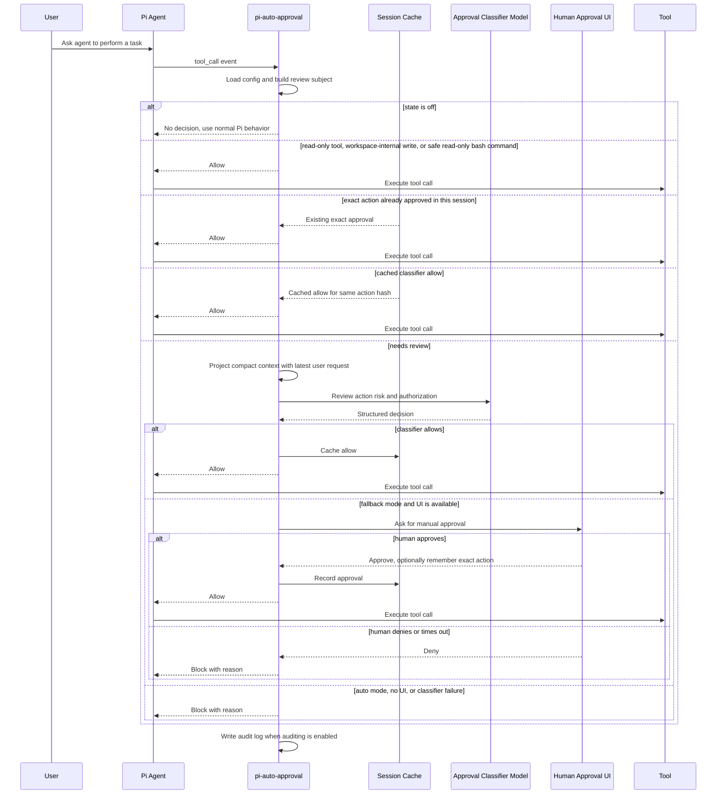

# pi-auto-approval

English | [中文](./README.zh-CN.md)

pi-auto-approval is an automatic approval extension for Pi, inspired by Claude Code auto mode and Codex Auto-review.

It uses an AI classifier to approve low-risk tool calls. Risky, denied, failed, or uncertain actions fall back to human approval or are blocked by the selected mode.

> [!IMPORTANT]
> This repository is a fork of [`Europa2061/pi-auto-approval`](https://github.com/Europa2061/pi-auto-approval). The `npm:pi-auto-approval` package points to the upstream project and does **not** include the fork-specific classifier compatibility fixes documented below. Install this fork from GitHub if you need those fixes.

## Changes in this fork

Compared with the upstream extension, this fork:

- loads `completeSimple` across the root and `/compat` entry points of both supported pi-ai package scopes, including default exports and a resolved `dist/compat.js` fallback;
- extracts classifier text robustly from content, output, text, and thinking fields, and reports bounded response diagnostics instead of masking empty provider responses;
- routes classifier calls through `ctx.modelRegistry.completeSimple` or `complete` when available, preserving Pi's configured authentication and provider behavior;
- omits `temperature` for Codex and models that declare it unsupported, and retries once without it when a provider rejects the parameter;
- preserves classifier failure reasons in human-fallback audit records and denial messages;
- adds regression coverage for compatibility loading, authenticated classifier calls, response extraction, diagnostics, temperature handling, and audit reasons.

## Installation

> **Security:** Pi packages run with full system access. Review [this fork's source](https://github.com/JLA97/pi-auto-approval) before installing.

This fork is currently distributed through GitHub rather than the upstream npm package.

**Global installation:**

```bash
pi install git:github.com/JLA97/pi-auto-approval
```

**Project-local installation** (writes to `.pi/settings.json`):

```bash
pi install -l git:github.com/JLA97/pi-auto-approval
```

**Ephemeral use** (current session only):

```bash
pi -e git:github.com/JLA97/pi-auto-approval
```

Reload Pi and enable the recommended mode:

```text
/reload
/auto-approval fallback
```

### Migrating from the upstream extension

Pi treats npm and Git sources as different packages. Remove the upstream source before installing this fork so the extension is not loaded twice.

Before removing it, run `/auto-approval status` and back up the displayed `config.jsonc` if you want to keep custom settings. The default config path is inside the installed package and does not move automatically between package sources.

```bash
# If upstream was installed from npm:
pi remove npm:pi-auto-approval

# Or, if upstream was installed from its Git repository:
pi remove git:github.com/Europa2061/pi-auto-approval

# Then install this fork:
pi install git:github.com/JLA97/pi-auto-approval
```

Use the same `-l` flag on `remove` and `install` when migrating a project-local installation. Start Pi again, restore the config to the new path shown by `/auto-approval status` if needed, then run `/reload`.

### Updating this fork

```bash
# Update this package only:
pi update git:github.com/JLA97/pi-auto-approval

# Or update all installed Pi packages:
pi update --extensions
```

## Commands

`/auto-approval` is the only slash command. Type `/auto-approval ` with a trailing space to see available arguments.

| Command | Effect |
| --- | --- |
| `/auto-approval status` | Show current state, approval classifier model, config path, and audit log path. |
| `/auto-approval off` | Disable automatic approval. Tool approvals return to Pi's normal behavior. |
| `/auto-approval fallback` | Enable AI review with human approval fallback when the classifier denies or fails. |
| `/auto-approval auto` | Enable AI review only. Classifier denial or failure blocks the tool call. |
| `/auto-approval model` | Open the model selector for the approval classifier model. |
| `/auto-approval model current` | Use the active Pi session model for approval classification. |
| `/auto-approval jev` | Show the Jev integration mode and thresholds. |
| `/auto-approval jev off` | Disable Jev; decisions use the chat classifier only (original behavior). |
| `/auto-approval jev cascade` | Jev decides confident bands; uncertain calls escalate to the chat classifier. |
| `/auto-approval jev shadow` | Jev runs in parallel and is only recorded in the audit log for accuracy testing. |

## Screenshot

`/auto-approval` argument completions expose the available modes and model selector directly in Pi.


## Architecture

pi-auto-approval sits between Pi tool calls and the normal approval path:

- command layer registers `/auto-approval` and persists local config;
- routing layer fast-paths disabled, read-only, workspace-safe, and session-approved actions;
- classifier layer projects recent session context and asks the selected model for a structured allow or deny decision;
- fallback layer asks the user when classifier review cannot safely approve;
- audit layer writes JSONL records when auditing is enabled.

## Approval Flow



## States

`off` means the extension does not make automatic approval decisions.

`fallback` means local fast paths handle actions that are already known to be low risk, such as trusted read-only tools, workspace-internal writes, explicitly allowlisted safe commands, or exact actions already approved in the session. Other tool calls go to the classifier first. If it allows, the tool runs. If it denies, fails, times out, or the tool is manual-only, Pi asks the human through the approval UI when UI is available.

`auto` means non-fast-path tool calls use the classifier as the approval gate. Local fast paths can still allow actions that are statically known to be low risk or already approved in the current session. For reviewed actions, a classifier allow runs the tool; a classifier deny, failure, timeout, manual-only tool, or repeated denial blocks the tool call.

## Safety

`fallback` is the recommended mode for normal interactive use. It lets local fast paths and the classifier reduce repeated prompts, but keeps human approval available when the classifier denies, fails, or times out.

`auto` is fail-closed for reviewed actions and should be used only in trusted unattended contexts. Classifier failures and denials block the tool call. Any local fast path must be narrowly defined and statically low risk; otherwise the action is reviewed or blocked.

## Classifier Model

By default, the approval classifier uses the current Pi session model. Use `/auto-approval model` to choose another available model from Pi's model selector.

The selected value is stored as `classifierModel` in `config.jsonc`. `null` means "use the current session model".

## References

This extension is an independent Pi package. Its approval workflow and terminal interaction design were informed by OpenAI Codex CLI and Claude Code-style coding-agent permission flows.

## Pi Smoke Regression

Run the local Pi-side smoke regression with:

```bash
npm run smoke:pi
```

The smoke script runs in temporary config and log directories. It verifies `/auto-approval fallback`, `/auto-approval auto`, safe bash command allow, suspicious bash command human fallback or denial, and JSONL audit log contents.

## Jev Integration (TypeSafe System One)

This fork adds an optional Jev integration. Jev ([TypeSafe](https://typesafe.ai)) is a System One decision model: it reads the same projected context the chat classifier sees and answers typed questions with calibrated probabilities (P(allow), risk level, user authorization) in ~0.3–1s at roughly $0.00003 per call.

Three modes, switchable at any time with `/auto-approval jev off|cascade|shadow` or via the `jev` block in `config.jsonc`:

| Mode | Behavior |
| --- | --- |
| `off` (default) | Jev is disabled. Behavior is identical to this fork before the change. |
| `cascade` | Before the chat classifier runs, Jev is asked one batched request. P(allow) ≥ `allowThreshold` (0.85) is approved directly; P(allow) ≤ `denyThreshold` (0.15) is treated as a high-confidence deny (human fallback in fallback mode); the uncertain band escalates to the chat classifier. If Jev fails, times out, or has no API key, the decision falls back to the chat classifier — cascade is never stricter than `off`. |
| `shadow` | Decisions are made exactly as in `off`, while Jev runs in parallel and its full judgment is recorded next to every chat decision in the audit log. Ideal for accuracy testing: compare `jevDecision.allowProbability` against `classifierDecision.outcome` offline with zero risk. |

### Configuration

```jsonc
"jev": {
  "mode": "off",                                  // off | cascade | shadow
  "baseUrl": "https://api.typesafe.ai",           // or https://openrouter.ai/api
  "apiKey": "",                                    // empty = TYPESAFE_API_KEY (or OPENROUTER_API_KEY)
  "model": "jev-latest",                          // typesafe/ prefix added automatically on OpenRouter
  "timeoutSeconds": 5,
  "allowThreshold": 0.85,
  "denyThreshold": 0.15
}
```

`baseUrl` does not normally need configuring — the default points at the TypeSafe API. Set it to `https://openrouter.ai/api` to bill through an OpenRouter key instead (the System One request format is identical; OpenRouter docs confirm compatibility), or to a self-hosted proxy if `api.typesafe.ai` is not reachable from your network.

### Audit log

Every classifier-path decision can carry three extra fields: `jevDecision` (probabilities, scores, confidence, token usage), `jevEscalated` (cascade escalated to the chat classifier), and `jevError` (Jev call failed). Cascade decisions use routes `jev` (direct allow) and `jev_deny` (high-confidence deny); shadow decisions keep the original routes. This is the dataset for accuracy analysis.
