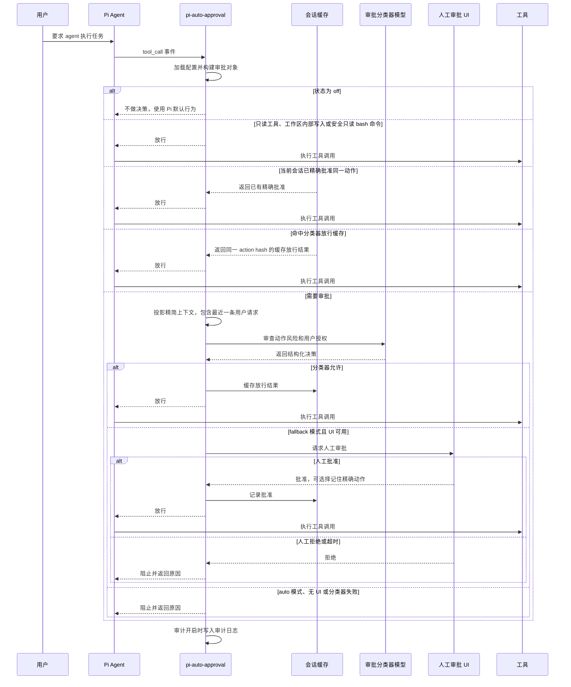

# pi-auto-approval

[English](./README.md) | 中文

pi-auto-approval 是一个为 Pi 开发的自动审批扩展，参考了 Claude Code auto mode 和 Codex Auto-review 的思路。

当 Pi agent 请求执行工具调用时，扩展会用 AI 分类器判断能否安全放行。低风险动作会自动批准；高风险、拒绝、失败或不确定的动作，会按当前模式回退到人工审批或直接阻止。

> [!IMPORTANT]
> 本仓库 fork 自 [`Europa2061/pi-auto-approval`](https://github.com/Europa2061/pi-auto-approval)。`npm:pi-auto-approval` 指向上游项目，**不包含**下方列出的分类器兼容性修复。需要这些修复时，请从 GitHub 安装本 fork。

## 本 fork 的变更

与上游版本相比，本 fork：

- 可从两个受支持 pi-ai 包作用域的根入口和 `/compat` 入口加载 `completeSimple`，兼容 default export，并提供解析后 `dist/compat.js` 的兜底路径；
- 可从 content、output、text 和 thinking 字段稳健提取分类器文本，并在响应为空时输出有长度限制的诊断信息，不再掩盖 provider 错误；
- 优先通过 `ctx.modelRegistry.completeSimple` 或 `complete` 调用分类器，沿用 Pi 已配置的认证信息和 provider 行为；
- 对 Codex 及声明不支持温度的模型省略 `temperature`，当 provider 拒绝该参数时自动移除并重试一次；
- 在人工兜底的审计记录和拒绝消息中保留分类器失败原因；
- 增加兼容入口、认证调用、响应提取、诊断信息、温度处理和审计原因的回归测试。

## 安装

> **安全提示：** Pi package 拥有完整系统权限。安装前请审阅[本 fork 的源码](https://github.com/JLA97/pi-auto-approval)。

本 fork 当前通过 GitHub 分发，而不是上游 npm 包。

**用户级安装：**

```bash
pi install git:github.com/JLA97/pi-auto-approval
```

**当前项目安装**（写入 `.pi/settings.json`）：

```bash
pi install -l git:github.com/JLA97/pi-auto-approval
```

**临时使用**（仅当前会话）：

```bash
pi -e git:github.com/JLA97/pi-auto-approval
```

重新加载 Pi 并启用推荐模式：

```text
/reload
/auto-approval fallback
```

### 从上游扩展迁移

Pi 会把 npm 和 Git 来源视为两个不同的包。安装本 fork 前请先移除上游来源，避免扩展被重复加载。

如果需要保留自定义配置，请先运行 `/auto-approval status`，备份其中显示的 `config.jsonc`。默认配置文件位于扩展安装目录内，更换安装来源时不会自动迁移。

```bash
# 如果上游版本从 npm 安装：
pi remove npm:pi-auto-approval

# 或者，如果上游版本从 Git 仓库安装：
pi remove git:github.com/Europa2061/pi-auto-approval

# 然后安装本 fork：
pi install git:github.com/JLA97/pi-auto-approval
```

迁移项目级安装时，在 `remove` 和 `install` 命令中使用相同的 `-l` 参数。重新启动 Pi；需要时，将配置恢复到 `/auto-approval status` 显示的新路径，然后运行 `/reload`。

### 更新本 fork

```bash
# 只更新本扩展：
pi update git:github.com/JLA97/pi-auto-approval

# 或更新所有已安装的 Pi package：
pi update --extensions
```

## 命令

`/auto-approval` 是唯一的斜杠命令。输入带尾随空格的 `/auto-approval ` 可以查看可用参数。

| 命令 | 效果 |
| --- | --- |
| `/auto-approval status` | 显示当前状态、审批分类器模型、配置文件路径和审计日志路径。 |
| `/auto-approval off` | 关闭自动审批。工具审批回到 Pi 的默认行为。 |
| `/auto-approval fallback` | 开启 AI 审批；当分类器拒绝或失败时，回退到人工审批。 |
| `/auto-approval auto` | 只使用 AI 审批。分类器拒绝或失败时直接阻止工具调用。 |
| `/auto-approval model` | 打开审批分类器模型选择器。 |
| `/auto-approval model current` | 使用当前 Pi 会话模型作为审批分类器模型。 |

## 截图

`/auto-approval` 参数补全会直接在 Pi 中展示可用模式和模型选择入口。


## 架构

pi-auto-approval 位于 Pi 工具调用和默认审批路径之间：

- 命令层注册 `/auto-approval` 并持久化本地配置；
- 路由层快速处理关闭、只读、工作区安全、会话已批准等动作；
- 分类器层投影最近会话上下文，并让选定模型返回结构化允许或拒绝决策；
- 兜底层在分类器无法安全放行时请求人工审批；
- 审计层在启用审计时写入 JSONL 记录。

## 审批流程



## 状态

`off` 表示扩展不做自动审批决策。

`fallback` 表示本地 fast path 会先处理已知低风险动作，例如可信只读工具、工作区内写入、显式 allowlist 的安全命令，或当前会话中已批准过的精确动作。其他工具调用会先交给分类器审批。如果分类器允许，工具会执行。如果分类器拒绝、失败、超时，或工具必须人工审批，并且 UI 可用，Pi 会通过审批 UI 询问人工确认。

`auto` 表示非 fast-path 工具调用由分类器作为审批关口。本地 fast path 仍然可以允许静态可证明低风险或当前会话已批准的动作。对于进入审批的动作，分类器允许时工具执行；分类器拒绝、失败、超时、工具必须人工审批，或连续拒绝过多时，工具调用会被阻止。

## 安全提示

普通交互使用推荐 `fallback`。它通过本地 fast path 和分类器减少重复确认，但分类器拒绝、失败或超时时仍会保留人工审批兜底。

`auto` 对进入审批的动作是失败即拒绝模式，只建议在可信的无人值守场景中使用。分类器失败或拒绝都会阻止工具调用。任何本地 fast path 都必须保持窄范围，并且能静态证明低风险；否则动作必须进入审批或被阻止。

## 分类器模型

默认情况下，审批分类器使用当前 Pi 会话模型。使用 `/auto-approval model` 可以从 Pi 的模型选择器中选择另一个可用模型。

选中的值会保存为 `config.jsonc` 中的 `classifierModel`。`null` 表示“使用当前会话模型”。

## 参考来源

本扩展是独立的 Pi package。审批工作流和终端交互设计参考了 OpenAI Codex CLI 以及 Claude Code 风格的 coding-agent 权限流程。

## Pi Smoke 回归测试

运行本地 Pi 侧 smoke 回归测试：

```bash
npm run smoke:pi
```

该脚本会在临时配置和日志目录中运行，验证 `/auto-approval fallback`、`/auto-approval auto`、安全 bash 命令放行、可疑 bash 命令的人工兜底或拒绝，以及 JSONL 审计日志内容。
